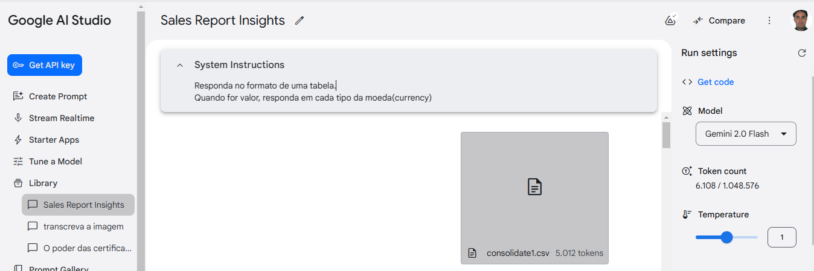

 

# Utilizando Prompts para Gerar Insights de Relatórios de Vendas

## Características
A empresa foca apenas em fabricação de consoles, deixando a distribuição e venda para terceiros. Os produtos são vendidos globalmente.

## Objetivos
- [x] Consolidar todas as bases de terceiros para realizar uma análise
- [x] Transformar dados de vendas em informações relevantes para a fabricante
- [x] Identificar os produtos mais populares em cada país
- [x] Otimizar o processo de transporte e logística até o momento da venda

## Estrutura do Projeto
- **data/processed_data/**: Contém os dados de vendas processados.
- **prompts/**: Contém os prompts utilizados para gerar insights.
- **imgs/**: Contém as imagens utilizadas na documentação.

## Prompts Utilizados
### Qual é a idade média dos compradores em cada país?
### Qual é a idade média dos compradores de cada produto vendido?
### Qual é o total de vendas (em valor monetário) por país de entrega? Responda quanto foi vendido em cada tipo da moeda (currency).
### Qual é a eficácia dos cupons de desconto em termos de valor total de desconto concedido e aumento nas vendas?
### Qual é a relação entre a quantidade de produtos comprados e a idade dos compradores?
### Qual é o valor da distribuição de vendas por plataforma de venda (Etsy, Shopee, AliExpress)?

Essas perguntas podem ajudar a obter insights valiosos sobre o comportamento dos clientes e a eficácia das estratégias de vendas e marketing.

## Configurações Google AI Studio

## Como Executar
1. Clone o repositório para sua máquina local.
2. Instale as dependências necessárias (por exemplo, `pandas` para manipulação de dados).
3. Execute os scripts de análise para gerar os insights desejados.

## Contribuição
Sinta-se à vontade para contribuir com este projeto. Abra uma issue ou envie um pull request com melhorias e correções.

## Licença
Este projeto está licenciado sob a Licença MIT. Veja o arquivo LICENSE para mais detalhes.

